# Redis (REmote Dictionary Server)

## 介绍

开源、使用C语言、BSD协议的键值对（key-value）内存数据库

## 功能与应用

- 分布式缓存，挡在mysql数据库之前的带到护卫（如果缓存命中，就不用查询MySQL，大大减少了查询时间，找不到再询问MySQL）
- 内存存储（RDB）和持久化（AOF）：支持异步将内存中的数据写入硬盘
- 高可用架构搭配：单机、主从、哨兵、集群
- 缓存穿透、击穿、雪崩
- 分布式锁
- 队列：提供list和set操作，使得Redis能作为一个好的消息队列平台使用（购买限制、节假日推广）
- ...

## 区别 （不是替换和竞争关系）

| MySQL（关系数据库） | Redis （NoSQL)                 |
| ------------------- | ------------------------------ |
| 磁盘(disk)          | 内存（in-memory)               |
| 一般                | 快（高性能、高并发、实时性高） |
| 相互配合            | 相互配合                       |

## 优势

- 性能极高 - Redis能读的速度是110000次/秒，写的速度是81000次/秒
- 数据类型丰富，不仅仅支持简单的Key-Value类型的数据，同时还提供list，set，zset，hash等数据结构的存储
- 支持数据的持久化，可以将内存中的数据保持在磁盘中，重启的时候可以再次加载进行使用
- 支持数据的备份，即master-slave模式的数据备份

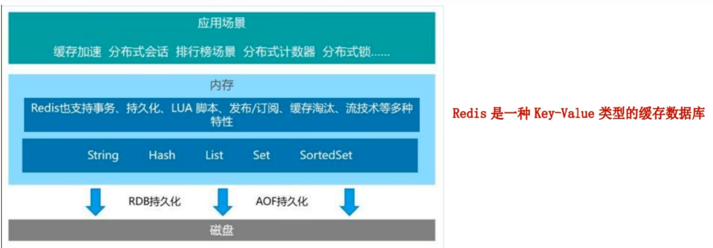

## 安装和介绍

默认安装在: usr/local/bin

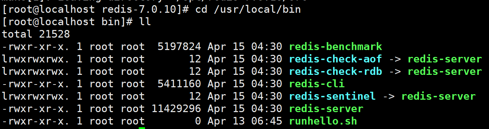

- redis-benchmark: 性能测试工具，服务启动后运行该命令，看看性能如何
- redis-check-aof: 修复有问题的AOF文件
- redis-check-dump: 修复有问题的dump.rdb文件
- ==redis-cli: 客户端，操作入口==
- redis-sentinel: redis集群使用
- ==redis-server: Redis服务器启动命令==

## 开启服务

- 复制redis7文件夹下的**redis.conf**到自己的redis文件夹中

```bash
mkdir /myredis
cp redis.conf /myredis/redis7.conf
```

- 修改redis7.conf文件

redis.conf配置文件，改完后确保生效，**记得重启，记得重启**

1. 默认daemonize no      改为    daemonize yes 意思是修改成后台启动
2. 默认protected-mode yes      改为    protected-mode no   禁用保护从而允许他人连接
3. 默认bind 127.0.0.1      注释掉   或改成本机IP地址，否则影响远程IP连接
4. 添加redis密码             改requirepass xxxxxxxx（xxxx为密码）

- 启动服务

```bash
redis-server /myredis/redis7.conf
```

使用刚刚配置好的redis7.conf启动redis服务

- 连接服务

```bash
redis-cli -a 123456 -p 6379
```

如果ping后显示PONG则redis服务器安装成功 

## 退出客户端

```bash
quit
```

只是退出客户端，没有退出服务器

## 永远的Hello World

```bash
set k1 helloworld
提示：OK
get k1
显示："helloworld"
```

## 关闭服务

- 单实例关闭：redis-cli -a 123456 shutdown

  如果你在客户端中，直接执行shutdown

- 多实例关闭，指定端口关闭：redis-cli -p 6379 shutdown

  关闭6379端口

# Redis 10大数据类型

声明：数据类型指的是value的数据类型，key的类型都是字符串

## redis字符串（String）

string类型是最基本的类型，一个key对应一个value

它是二进制安全的，意思是redis的string可以包含任何数据，比如jpg图片或者序列化的对象

一个redis中字符串value最多可以是512M

## redis列表（List）

简单的字符串列表，按照插入顺序排序。可以添加一个元素到列表的头部（左边）或者尾部（右边）

它的底层是一个双向链表，最多可以包含2^32^-1个元素（4294967295，每个列表超过40亿个元素）

## redis哈希表（Hash）

一个string类型的field（字段）和value（值）的映射表，hash特别适合用于存储对象

## redis集合（Set）

是string类型的无序集合。集合成员是唯一的，这意味着集合不能出现重复的数据，集合对象的编码可以是intset或者hashtable。

底层是通过哈希表实现的，所以添加删除查找的复杂度都是O（1）

## redis有序集合（ZSet）

ZSet 也是 sorted set，有序集合

Redis zeset和set一样也是string类型元素的集合，且不允许重复成员

**不同的是每个元素都会关联一个double类型的分数**，redis正是通过分数来为集合中的成员进行从小到大的排序

**zset的成员是唯一的，但分数（score）却可以重复**

**zset集合是通过哈希表实现的，所以添加删除查找的复杂度都是O（1）**

## redis地理空间（GEO）

主要用于存储地理位置信息，并对存储信息进行操作，包括

- 添加地理位置的坐标
- 获取地理位置的坐标
- 计算两个位置之间的距离
- 根据用户给定的经纬度坐标来获取指定范围内的地理位置集合

## redis基数统计（HyperLogLog）

用来做**基数统计**，优点是在输入元素的数量或者体积非常大时，计算基数所需的空间总是固定且是很小的

每个HyperLogLog键只需要花费12kb内存，就可以计算接近2^64^个不同元素的基数。这和计算基数时，元素越多耗费内存就越多的集合形成鲜明对比

但是它只会根据输入元素来计算基数，而不会储存输入元素本身，所以不能像集合那样，返回输入的各个元素

## redis位图

Bit arrays（or simply bitmaps，我们可以称为 位图）

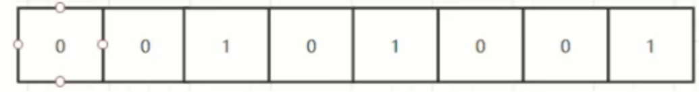

一个字节（1byte）=8位（bit）

一般用于只需要判断对与错，0和1的情况

## redis位域

通过bitfield命令可以一次性操作多个**比特位域（指的是连续的多个比特位）**，它会执行一系列操作并返回一个响应数组，这个数组中的元素对应参数列表中的相应操作的执行结果。

## redis流（Stream）

用于消息队列（MQ，Message Queue），redis本身有一个redis发布订阅（pub/sub）来实现消息队列功能，但它有个缺点就是消息无法持久化，如果网络断开、redis宕机，消息就会被丢弃


简单来说，pub/sub可以分发消息，但无法记录历史消息。

而Stream提供了消息的持久化和主备复制功能，可以让任何客户端访问任何时刻的数据，并且能够记住每一个客户端的访问位置，还能保证消息不丢失


## Rides 键（key）

```bash
查看当前库所有key
keys *

判断某个key是否存在
exists key

查看key是什么类型
type key

删除指定key数据
del key
非阻塞删除，仅仅将keys从keyspace元数据中删除
unlink key

查看还有多少秒过期，-1标识永不过期，-2标识已经过期
ttl key
给key设置过期时间
expire key 秒钟

将当前数据的key移动到给定数据库中
move key dbindex 【0~15】
切换数据库【0-15】默认为0，可以在配置文件修改
select 【0-15】
查看当前数据库key的数量
dbsize

清空当前库
flushdb
通杀全部库
flushall
```

## 数据类型命令及落地运用

- 命令不区分大小写，而key是区分大小写的
- 永远的帮助命令，help @类型     例如：help @string

### Redis字符串（string）

```bash
SET key value [NX | XX] [GET] [EX seconds | PX milliseconds | EXAT unix-time-seconds | PXAT unix-time-milliseconds | KEEPTTL]
```

KEEPTTL为6.0版本添加的可选参数，其他为2.6.12版本添加的可选参数

- EX seconds：以秒为单位设置过期时间
- PX millisenconds：以毫秒为单位设置过期时间
- EXAT timestamp：设置以秒为单位的UNIX时间戳所对应的时间为过期时间
- PXAT millisecons-timestamp：设置以毫秒为单位的UNIX时间戳所对应的时间为过期时间
- NX：键不存在的时候设置键值
- XX：键存在的时候设置键值
- KEEPTTL：保留设置前指定键的过期时间


- GET：返回指定键原本的值，若不存在时返回nil

> SET命令使用EX、PX、NX参数，其效果等同于SETEX、PSETEX、SETNX命令。根据官方文档描述，未来版本中SETEX、PSETEX、SETNX可能会被淘汰
>
> EXAT、PXAT以及GET为6.2版本新增可选参数

#### 返回值

设置成功返回OK；返回nil为未执行SET命令，如不满足NX、XX条件等

若使用GET参数，则返回原来的值，或键不存在返回nil


如何设置指定的Key过期的UNIX时间，单位为秒

### 同时设置/获取多个键值

```bash
mset k1 v1 k2 v2
相当于
set k1 v1
set k2 v2

同理
mget k1 k2
```

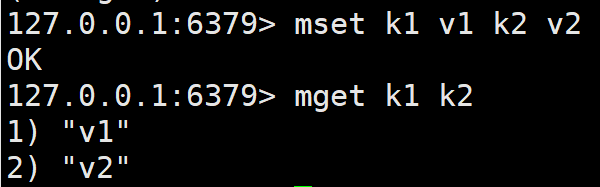

- getrange key startIndex endIndex

```bash
set k1 abcde
getrange k1 0 -1
```

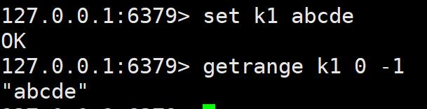

- setrange key startIndex 替换的字符串

```bash
set k1 1 xxyy
get k1
```

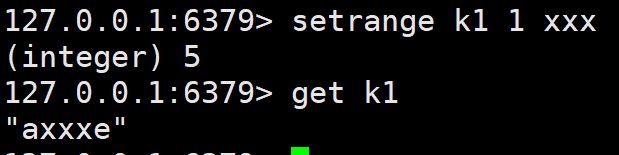

### 数值增减

==一定要是数字才能进行加减==

#### 数值增加

```bash
set k1 100
每次增加1
incr k1

设置每次增加的值
incrby k1 3
```

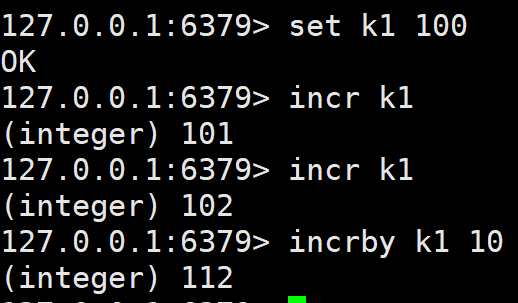

#### 同理递减

```bash
set k1 100
每次减1
decr k1
设置每次减少的值
decrby k1 10
```

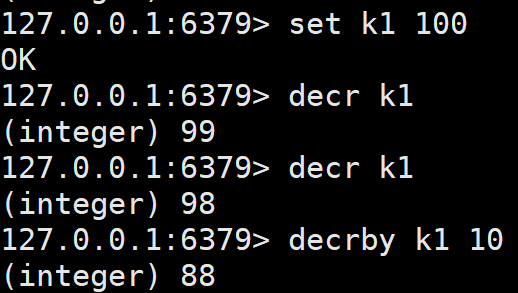

### 获取字符串长度和内容追加

```bash
set k1 abcd
获取长度
strlen k1
追加内容
append k1 xxxx
```

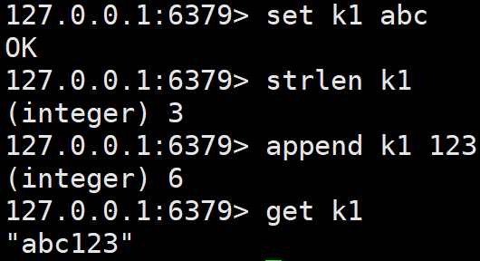

### 分布式锁

```bash
SET key value [NX | XX] [GET] [EX seconds | PX milliseconds | EXAT unix-time-seconds | PXAT unix-time-milliseconds | KEEPTTL]
```

- EX：key在多少秒后过期
- PX：key在多少毫秒之后过期
- NX：当key==不存在==的时候，才创建key，效果等同于setnx
- XX：当key==存在==的时候，覆盖key

```bash
setex k1 10 v11
ttl k1
setnx k1 v11
```

过期才创建新的k1

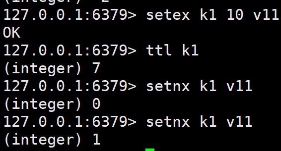

### getset(先get再set)

```bash
getset k1 haha
get k1
等同于
set k1 v1 get
getk1
```

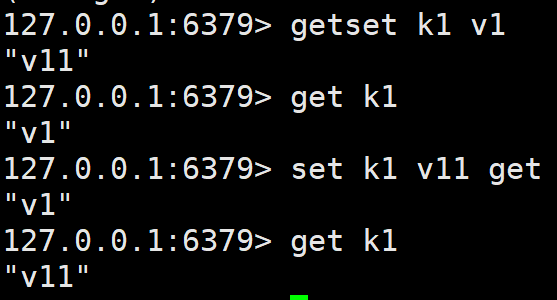

### Redis列表 (List)

底层时一个双向链表的结构，主要功能有push/pop，一般用在栈、队列和消息队列等等

left、right都可以插入添加；

如果键不存在，创建新的链表

如果键已存在，新增内容；

如果值全移除，对应的键也就消失了。

- 两端的操作性很高，通过索引下标的操作中间的节点性能会很差。

#### lpush/rpush/lrange

```bash
lpush list1 1 2 3 4 5           --5
rpush list2 11 22 33 44 55          --5
type list1         -- list
lrange list1 0 -1            - 5 4 3 2 1
lrange list2 0 -1            - 11 22 33 44 55
```

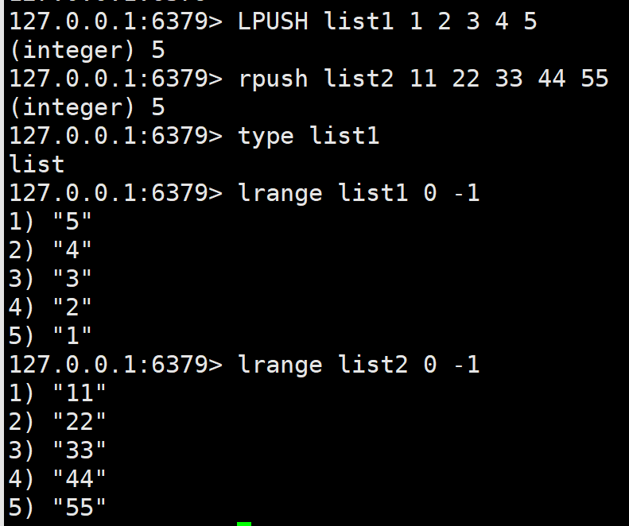

* 没有Rrange

#### lpop/rpop

```bash
lpop list1    -- 5
lrange list1 0 -1         -- 4 3 2 1
rpop list1             -- 1
lrange list1 0 -1      -- 4 3 2
```

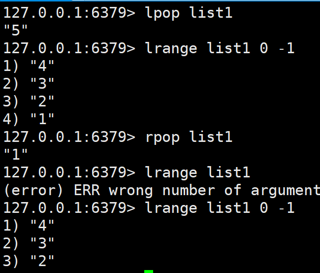

#### lindex

按照索引下标获得元素（从上到下）

```bash
lindex list1 0 -- 4
```

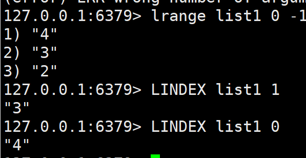

#### llen

获取列表中元素的个数

```bash
llen list1
llen list2
```

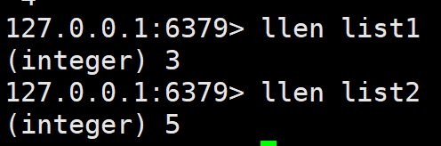

#### lrem

- lrem key 数字N 给定值 v1
- 解释：从left往right删除N个值等于v1的元素
- 返回值：实际删除的数量
- lrem list1 0 值，表示删除全部给定的值。零个就是全部值

```bash
lrem list3 3 1
lrange list3 0 -1
lrem list3 0 3       -- 把3全部删除
```


#### ltrim

- ltrim key 开始index 结束index

- 解释：截取指定返回的值再赋给key
- 返回值：OK

```bash
ltrim list3 0 3
lrange list3 0 -1
```

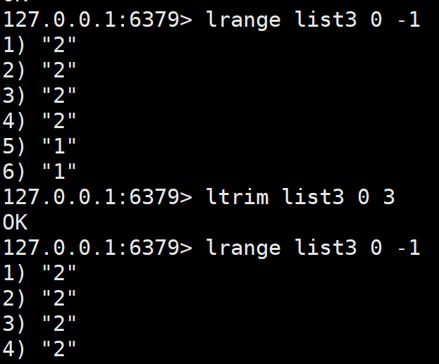

#### rpoplpush

- rpoplpush 源列表 目的列表
- 移除列表最后一个元素，并将该元素添加至另一个列表并返回
- 返回值：被操作的元素

```bash
rpoplpush list1 list2
lrange list2 0 -1
```

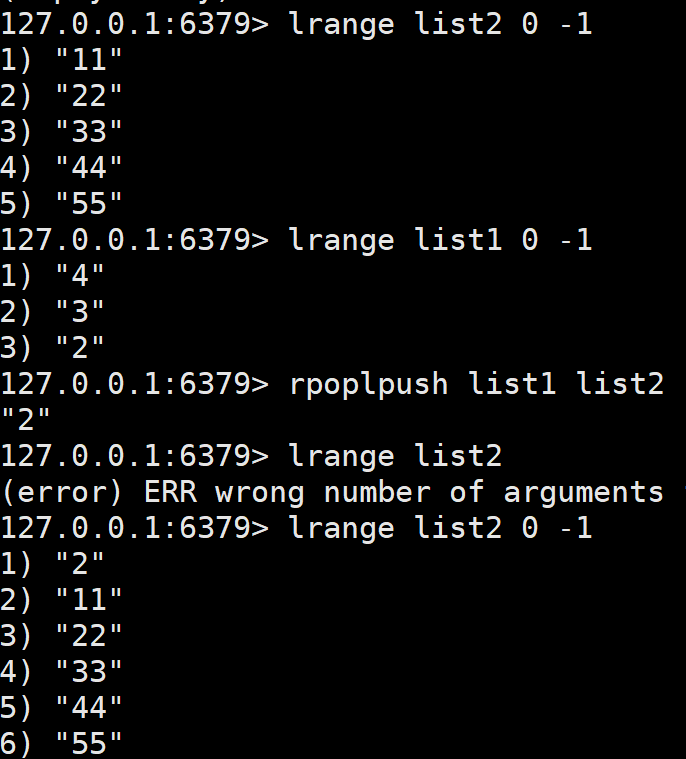

#### lset 

- lset key index element
- 解释：从key的left开始的index索引位置设置element的值

```bash
lset list1 2 marvin
lrange list1 0 -1
```

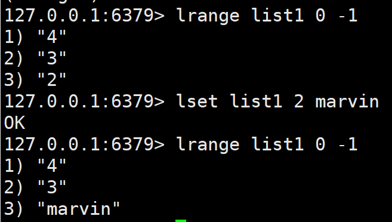

#### linsert

- linsert key before/after 已有值 插入新的值
- 解释：在key的已有值 前/后 插入新的值

```bash
linsert list1 before marvin benny
```


#### 案例

1. 新文章发布，id为33 和 44

2. 我关注了这个作者，只要发布新文章就会安装进List中

   lpush myList 33 44

3. 查看列表中这个作者的全部文章，分页显示10条

   lrange myList 0 9

### Redis哈希（Hash）

Key-value模式不变，但是value是一个键值对

#### hset/hget

```
hset user:001 id 11 name z3 age 25
hget user:001 id
hget user:001 name
hget user:001 age
```

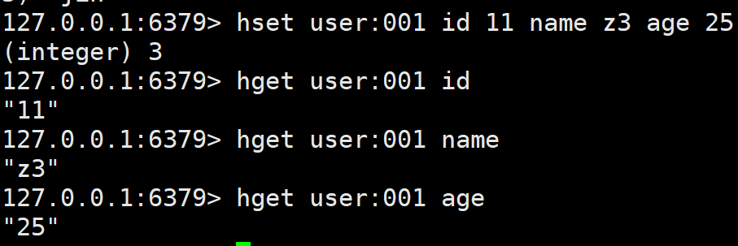

#### hmset/hmget

批处理

```bash
hmset user:001 id 22 name l4 age 21
hmget user:001 id name age
```

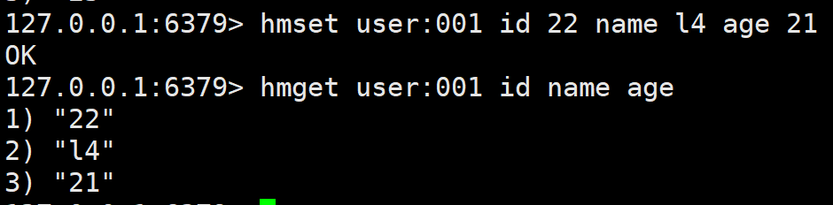

#### hgetall/hdel

hgetall: 遍历全部

hdel: 删除指定value的key

```bash
hgetall user:001
hdel user:001 age
```

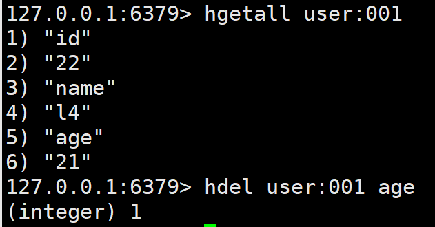

#### hlen

获取某个key内的全部数量

```bash
hlen user:001
```

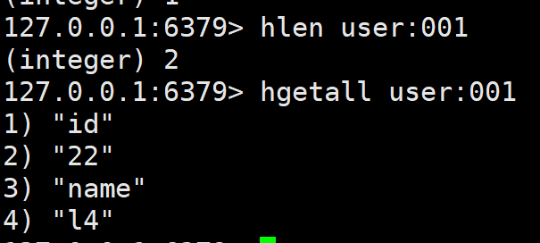

#### hexists

在key里某个key 是否存在

返回值：1存在，0不存在

```bash
hexists user:001 name  --1
hexists user:001 score  --0
```

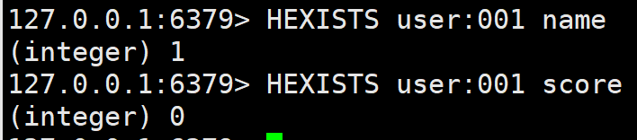

#### hkeys

列出hash里面的所有key

#### hvals

列出hash里面的所有value

```bash
hkeys user:001
hvals user:001
```

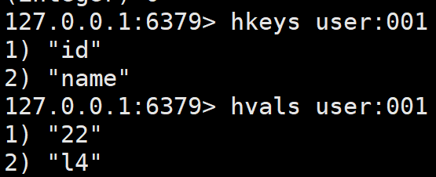

#### hincrby/hincrbyfloat

```bash
hincrby user:001 age 5
hincrbyfloat user:001 score 0.5
```

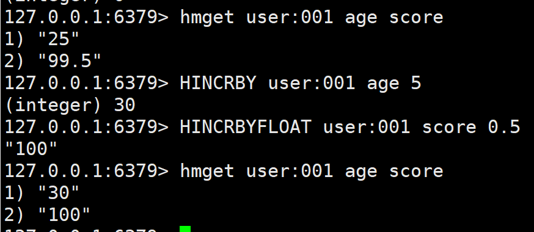

#### hsetnx

不存在就赋值，存在无效

返回值：0为失效，1为成功

```bash
hsetnx user:001 id 22
hsetnx user:001 id 23
```

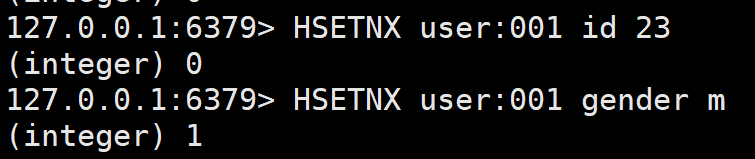

### Redis集合（Set）

单值多value，且无重复

#### sadd

自动去重

```bash
sadd set1 1 1 1 2 2 2 3 4 5
smembers set1
```

#### smembers 

查看set中的元素

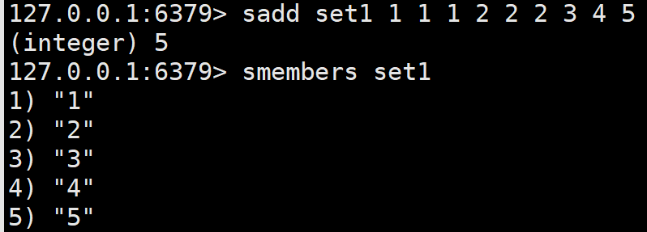

#### sismember

判断 某个值 是否为set中的值

返回值：0不是，1是

``` bash
sismember set1 x
sismember set1 1
```

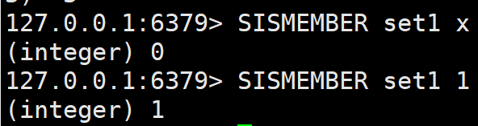

#### srem

删除set中的某个元素

返回值：成功1，失败0

```bash
srem set1 y
srem set1 1
```

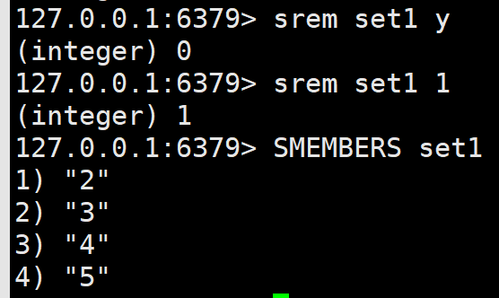

#### scard

统计元素个数

```bash
scard set1
```

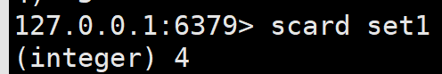

#### srandmember 

从集合中随机==展现设置的数字个数==元素，元素不删除

```bash
srandmember set1 3  --随机展现3个
```

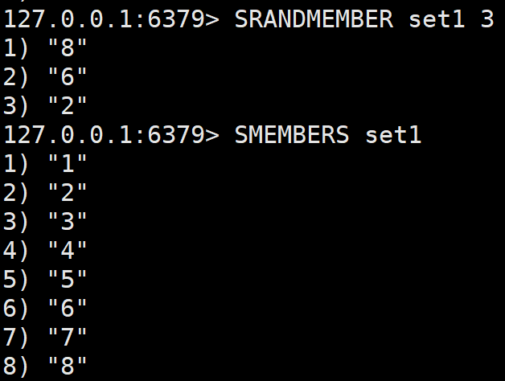

#### spop

从集合中随机==弹出==一个元素，出一个删一个

```bash
spop set1 3 --随机弹出3个
```

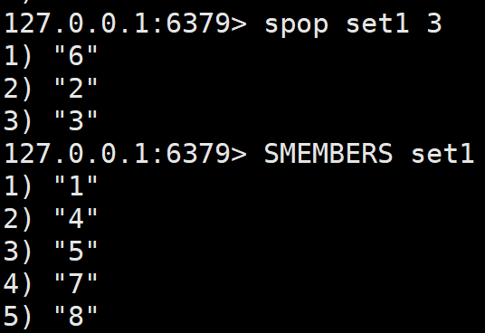

#### smove

从set1取一个值移到set2中

```bash
smove set1 set2 5  --把set1 中的 5 移动到 set2中
```

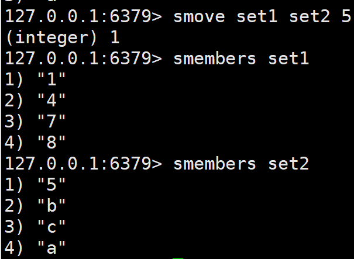

#### 集合运算

- A集合：`a b c 1 2`
- B集合：`1 2 3 a x`

##### 集合的差集运算A-B

- 属于A但不属于B的元素构成的集合

```bash
sdiff set1 set2
```

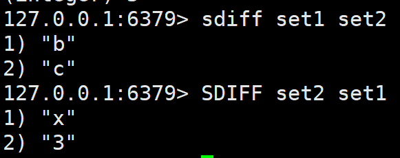

##### 集合的并集运算A U B 

- 属于A或者属于B的元素合并后的集合

```bash
sunion set1 set2
```

相当于A+B然后去重

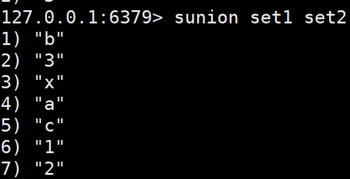

##### 集合的交集运算A ∩ B

- 属于A同时也属于B

```bash
sinter set1 set2
sintercard 2 set1 set2 
```

`sintercard numkeys key [key ...] [LIMIT limit]`为 Redis7 新增命令

解释：返回2个key set1和set2 的交集结果的基数，也就是结果有几个，limit为限制显示几个

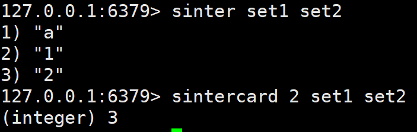

#### 案例

- 微信抽奖小程序 （spop）
- 朋友圈点赞查看同赞好友 (sadd, srem)
- QQ内推可能认识的人 (sdiff)

### Redis有序集合Zset（sorted set）

和set不同的是，每个value都是一个score-value的形式

`score`：代表一个排序的分数值（从低到高）

#### zadd

```bash
zadd zset1 60 v1 70 v2 80 v3
```

#### zrange

遍历

```bash
zrange zset1 0 -1 [withscores]
```

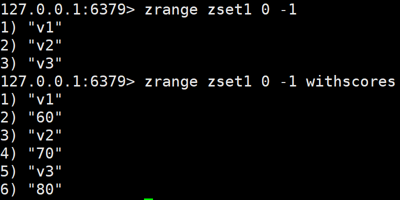

#### zrerange

反转遍历

```bash
zrevrange zset1 0 -1 [withscores]
```

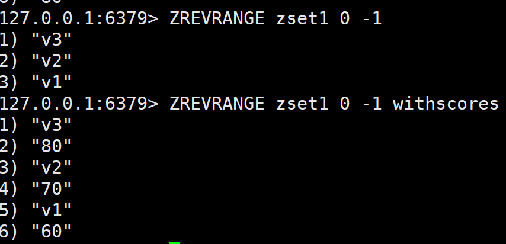

#### zrangebyscores

- `zrangebyscore key min max [withscores][limit offset count]`
- 解释：
  - 在score的[min, max]范围内取值
  - `（`代表不包含
  - limit：限制显示个数，有显示区间[0, 1)

```bash
zrangebyscore zset1 60 70 withscores limit 0 1  --显示带着分数[60, 70]的值，显示1个
zrangebyscore zset1 (60 70 withscores limit 0 1 --显示带着分数（60, 70]的值，显示1个
```

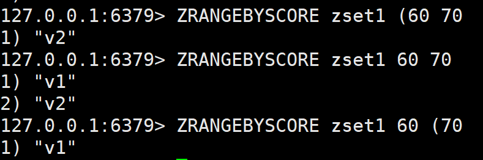

#### zscore

查询分数

```bash
zscore zset1 v1
```

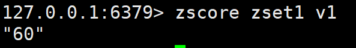

#### zcard

查询个数

```bash
zcard zset1
```

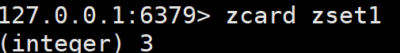

#### zrem

删除对应的value值

```bash
zrem zset1 v1
```

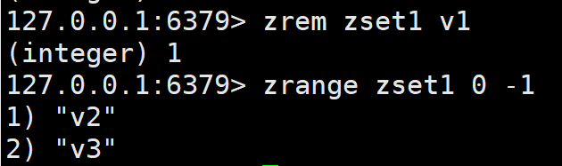

#### zincrby

增加某个元素的分数

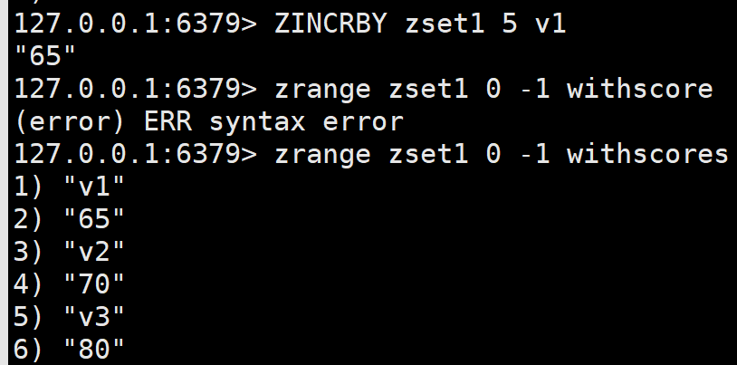

#### zcount

获取指定分数范围内的元素个数

返回值：元素个数

```bash
zcount zset1 60 80
```

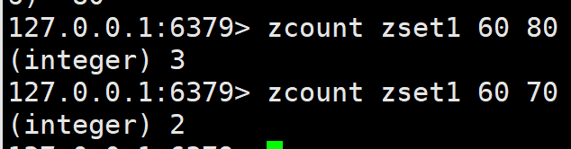

#### zmpop 

- `ZMPOP numkeys key [key] min|max [COUNT count]`

Redis7新命令，从键名列表的第一个非空排序集中弹出一个或多个元素，它们是成员分数对（值和分数）

```bash
zmpop 1 zset1 min count 1  --弹出zset1中最小的一个值
```

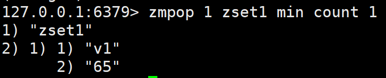

#### zrank/zrevrank

- `zrank`:**从小到大**这个value排第几位
- `zrevrank`:**从大到小**这个value排第几位

```bash
zrank zset1 v1
zrevrank zset1 v1
```

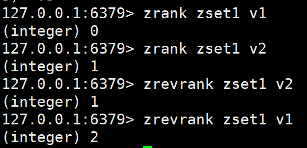

#### 案例

- 商品热销排行：销售量为score，商品编号为value，购买**zincrby**增加数量，排行**zrevrange**

### Redis位图（bitmap）

- 由0和1状态表现的二进制位的bit数组
- 需求：用户是否登陆过/视频、广告是否点击/签到


- 上面是 1 字节 (bit )所存储的 8 位 (byte)的数据，每位由0和1构成
- 本质：用string类型作为底层数据结构实现的一种统计二值状态的数据类型，位图本质是数组
- 作用：状态统计

#### setbit key offset(偏移量) value

- 偏移量是从0开始的

```bash
setbit k1 1 1
setbit k1 7 1
get k1
```

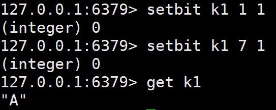

存储后k1内部是：`01000001`

k1的下标展示：   ` 01234567  `   

由于本质是string，所以可以使用get来获取k1

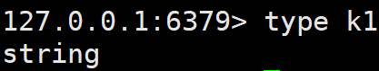

#### getbit

```bash
getbit k1 1 
getbit k1 0
```

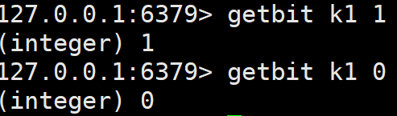

#### strlen

字节统计，8位为1个字节

```bash
strlen k1
setbit k1 8 1
strlen k1
```

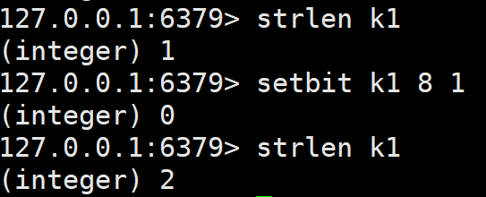

由于超过8位，所以算2个字节

#### bitcount

全部键中含多少个1

```bash
setbit uid:marvin 0 1
setbit uid:marvin 1 1
setbit uid:marvin 2 1
bitcount uid:marvin
```


可以统计登录或签到次数

#### bitop

`bitop operation destkey key [key]`

- operation：and, or, not, xor

```bash
-- 20230101的时候用户登录情况 偏移量映射为用户，后面0，1为是否登录
setbit 20230101 0 1
setbit 20230101 1 1
setbit 20230101 2 1

-- 20230102的时候用户登录情况
setbit 20230102 0 1
setbit 20230102 2 1

bitcount 20230101
bitcount 20230102

统计这两天的在线人数
bitop and k3 20230101 20230102
bitcount k3  --最后查看结果
```


#### 案例

- 同bitop，统计登录
- 一年365天，统计全年登录占用多少字节？

```bash
setbit k1 0 1   -- 第1天登录
setbit k1 1 1 	-- 第2天登录
setbit k1 364 1  -- 第365天登录
bitcount k1 	-- 统计一年登录多少天
strlen k2		-- 统计占用多少字节
```


> 只占46字节。
>
> 按年去存储一个用户的签到情况，365天只需要365

 
