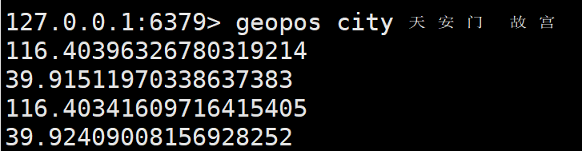
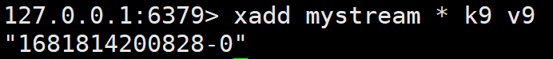
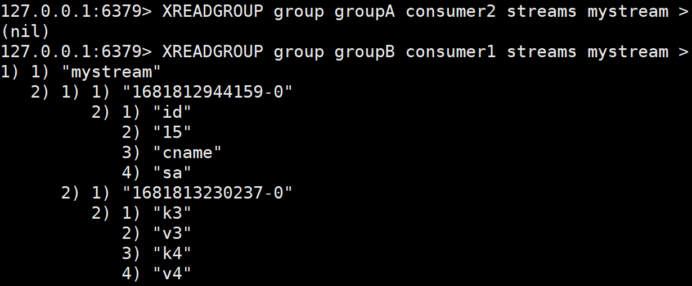

# Redis (REmote Dictionary Server)

## 介绍

开源、使用C语言、BSD协议的键值对（key-value）内存数据库

## 功能与应用

- 分布式缓存，挡在mysql数据库之前的带到护卫（如果缓存命中，就不用查询MySQL，大大减少了查询时间，找不到再询问MySQL）
- 内存存储（RDB）和持久化（AOF）：支持异步将内存中的数据写入硬盘
- 高可用架构搭配：单机、主从、哨兵、集群
- 缓存穿透、击穿、雪崩
- 分布式锁
- 队列：提供list和set操作，使得Redis能作为一个好的消息队列平台使用（购买限制、节假日推广）
- ...

## 区别 （不是替换和竞争关系）

| MySQL（关系数据库） | Redis （NoSQL)                 |
| ------------------- | ------------------------------ |
| 磁盘(disk)          | 内存（in-memory)               |
| 一般                | 快（高性能、高并发、实时性高） |
| 相互配合            | 相互配合                       |

## 优势

- 性能极高 - Redis能读的速度是110000次/秒，写的速度是81000次/秒
- 数据类型丰富，不仅仅支持简单的Key-Value类型的数据，同时还提供list，set，zset，hash等数据结构的存储
- 支持数据的持久化，可以将内存中的数据保持在磁盘中，重启的时候可以再次加载进行使用
- 支持数据的备份，即master-slave模式的数据备份


## 安装和介绍

默认安装在: usr/local/bin


- redis-benchmark: 性能测试工具，服务启动后运行该命令，看看性能如何
- redis-check-aof: 修复有问题的AOF文件
- redis-check-dump: 修复有问题的dump.rdb文件
- ==redis-cli: 客户端，操作入口==
- redis-sentinel: redis集群使用
- ==redis-server: Redis服务器启动命令==

## 开启服务

- 复制redis7文件夹下的**redis.conf**到自己的redis文件夹中

```bash
mkdir /myredis
cp redis.conf /myredis/redis7.conf
```

- 修改redis7.conf文件

redis.conf配置文件，改完后确保生效，**记得重启，记得重启**

1. 默认daemonize no      改为    daemonize yes 意思是修改成后台启动
2. 默认protected-mode yes      改为    protected-mode no   禁用保护从而允许他人连接
3. 默认bind 127.0.0.1      注释掉   或改成本机IP地址，否则影响远程IP连接
4. 添加redis密码             改requirepass xxxxxxxx（xxxx为密码）

- 启动服务

```bash
redis-server /myredis/redis7.conf
```

使用刚刚配置好的redis7.conf启动redis服务

- 连接服务

```bash
redis-cli -a 123456 -p 6379
```

如果ping后显示PONG则redis服务器安装成功 

## 退出客户端

```bash
quit
```

只是退出客户端，没有退出服务器

## 永远的Hello World

```bash
set k1 helloworld
提示：OK
get k1
显示："helloworld"
```

## 关闭服务

- 单实例关闭：redis-cli -a 123456 shutdown

  如果你在客户端中，直接执行shutdown

- 多实例关闭，指定端口关闭：redis-cli -p 6379 shutdown

  关闭6379端口

# Redis 10大数据类型

声明：数据类型指的是value的数据类型，key的类型都是字符串

## redis字符串（String）

string类型是最基本的类型，一个key对应一个value

它是二进制安全的，意思是redis的string可以包含任何数据，比如jpg图片或者序列化的对象

一个redis中字符串value最多可以是512M

## redis列表（List）

简单的字符串列表，按照插入顺序排序。可以添加一个元素到列表的头部（左边）或者尾部（右边）

它的底层是一个双向链表，最多可以包含2^32^-1个元素（4294967295，每个列表超过40亿个元素）

## redis哈希表（Hash）

一个string类型的field（字段）和value（值）的映射表，hash特别适合用于存储对象

## redis集合（Set）

是string类型的无序集合。集合成员是唯一的，这意味着集合不能出现重复的数据，集合对象的编码可以是intset或者hashtable。

底层是通过哈希表实现的，所以添加删除查找的复杂度都是O（1）

## redis有序集合（ZSet）

ZSet 也是 sorted set，有序集合

Redis zeset和set一样也是string类型元素的集合，且不允许重复成员

**不同的是每个元素都会关联一个double类型的分数**，redis正是通过分数来为集合中的成员进行从小到大的排序

**zset的成员是唯一的，但分数（score）却可以重复**

**zset集合是通过哈希表实现的，所以添加删除查找的复杂度都是O（1）**

## redis地理空间（GEO）

主要用于存储地理位置信息，并对存储信息进行操作，包括

- 添加地理位置的坐标
- 获取地理位置的坐标
- 计算两个位置之间的距离
- 根据用户给定的经纬度坐标来获取指定范围内的地理位置集合

## redis基数统计（HyperLogLog）

用来做**基数统计**，优点是在输入元素的数量或者体积非常大时，计算基数所需的空间总是固定且是很小的

每个HyperLogLog键只需要花费12kb内存，就可以计算接近2^64^个不同元素的基数。这和计算基数时，元素越多耗费内存就越多的集合形成鲜明对比

但是它只会根据输入元素来计算基数，而不会储存输入元素本身，所以不能像集合那样，返回输入的各个元素

## redis位图

Bit arrays（or simply bitmaps，我们可以称为 位图）


一个字节（1byte）=8位（bit）

一般用于只需要判断对与错，0和1的情况

## redis位域

通过bitfield命令可以一次性操作多个**比特位域（指的是连续的多个比特位）**，它会执行一系列操作并返回一个响应数组，这个数组中的元素对应参数列表中的相应操作的执行结果。

## redis流（Stream）

用于消息队列（MQ，Message Queue），redis本身有一个redis发布订阅（pub/sub）来实现消息队列功能，但它有个缺点就是消息无法持久化，如果网络断开、redis宕机，消息就会被丢弃


简单来说，pub/sub可以分发消息，但无法记录历史消息。

而Stream提供了消息的持久化和主备复制功能，可以让任何客户端访问任何时刻的数据，并且能够记住每一个客户端的访问位置，还能保证消息不丢失


## Rides 键（key）

```bash
查看当前库所有key
keys *

判断某个key是否存在
exists key

查看key是什么类型
type key

删除指定key数据
del key
非阻塞删除，仅仅将keys从keyspace元数据中删除
unlink key

查看还有多少秒过期，-1标识永不过期，-2标识已经过期
ttl key
给key设置过期时间
expire key 秒钟

将当前数据的key移动到给定数据库中
move key dbindex 【0~15】
切换数据库【0-15】默认为0，可以在配置文件修改
select 【0-15】
查看当前数据库key的数量
dbsize

清空当前库
flushdb
通杀全部库
flushall
```

# 数据类型命令及落地运用

- 命令不区分大小写，而key是区分大小写的
- 永远的帮助命令，help @类型     例如：help @string

## Redis字符串（string）

```bash
SET key value [NX | XX] [GET] [EX seconds | PX milliseconds | EXAT unix-time-seconds | PXAT unix-time-milliseconds | KEEPTTL]
```

KEEPTTL为6.0版本添加的可选参数，其他为2.6.12版本添加的可选参数

- EX seconds：以秒为单位设置过期时间
- PX millisenconds：以毫秒为单位设置过期时间
- EXAT timestamp：设置以秒为单位的UNIX时间戳所对应的时间为过期时间
- PXAT millisecons-timestamp：设置以毫秒为单位的UNIX时间戳所对应的时间为过期时间
- NX：键不存在的时候设置键值
- XX：键存在的时候设置键值
- KEEPTTL：保留设置前指定键的过期时间


- GET：返回指定键原本的值，若不存在时返回nil

> SET命令使用EX、PX、NX参数，其效果等同于SETEX、PSETEX、SETNX命令。根据官方文档描述，未来版本中SETEX、PSETEX、SETNX可能会被淘汰
>
> EXAT、PXAT以及GET为6.2版本新增可选参数

### 返回值

设置成功返回OK；返回nil为未执行SET命令，如不满足NX、XX条件等

若使用GET参数，则返回原来的值，或键不存在返回nil


如何设置指定的Key过期的UNIX时间，单位为秒

### 同时设置/获取多个键值

```bash
mset k1 v1 k2 v2
相当于
set k1 v1
set k2 v2

同理
mget k1 k2
```


- getrange key startIndex endIndex

```bash
set k1 abcde
getrange k1 0 -1
```


- setrange key startIndex 替换的字符串

```bash
set k1 1 xxyy
get k1
```


### 数值增减

==一定要是数字才能进行加减==

### 数值增加

```bash
set k1 100
每次增加1
incr k1

设置每次增加的值
incrby k1 3
```


### 同理递减

```bash
set k1 100
每次减1
decr k1
设置每次减少的值
decrby k1 10
```


### 获取字符串长度和内容追加

```bash
set k1 abcd
获取长度
strlen k1
追加内容
append k1 xxxx
```


### 分布式锁

```bash
SET key value [NX | XX] [GET] [EX seconds | PX milliseconds | EXAT unix-time-seconds | PXAT unix-time-milliseconds | KEEPTTL]
```

- EX：key在多少秒后过期
- PX：key在多少毫秒之后过期
- NX：当key==不存在==的时候，才创建key，效果等同于setnx
- XX：当key==存在==的时候，覆盖key

```bash
setex k1 10 v11
ttl k1
setnx k1 v11
```

过期才创建新的k1


### getset(先get再set)

```bash
getset k1 haha
get k1
等同于
set k1 v1 get
getk1
```


## Redis列表 (List)

底层时一个双向链表的结构，主要功能有push/pop，一般用在栈、队列和消息队列等等

left、right都可以插入添加；

如果键不存在，创建新的链表

如果键已存在，新增内容；

如果值全移除，对应的键也就消失了。

- 两端的操作性很高，通过索引下标的操作中间的节点性能会很差。

### lpush/rpush/lrange

```bash
lpush list1 1 2 3 4 5           --5
rpush list2 11 22 33 44 55          --5
type list1         -- list
lrange list1 0 -1            - 5 4 3 2 1
lrange list2 0 -1            - 11 22 33 44 55
```


* 没有Rrange

### lpop/rpop

```bash
lpop list1    -- 5
lrange list1 0 -1         -- 4 3 2 1
rpop list1             -- 1
lrange list1 0 -1      -- 4 3 2
```


### lindex

按照索引下标获得元素（从上到下）

```bash
lindex list1 0 -- 4
```


### llen

获取列表中元素的个数

```bash
llen list1
llen list2
```


### lrem

- lrem key 数字N 给定值 v1
- 解释：从left往right删除N个值等于v1的元素
- 返回值：实际删除的数量
- lrem list1 0 值，表示删除全部给定的值。零个就是全部值

```bash
lrem list3 3 1
lrange list3 0 -1
lrem list3 0 3       -- 把3全部删除
```


### ltrim

- ltrim key 开始index 结束index

- 解释：截取指定返回的值再赋给key
- 返回值：OK

```bash
ltrim list3 0 3
lrange list3 0 -1
```


### rpoplpush

- rpoplpush 源列表 目的列表
- 移除列表最后一个元素，并将该元素添加至另一个列表并返回
- 返回值：被操作的元素

```bash
rpoplpush list1 list2
lrange list2 0 -1
```


### lset 

- lset key index element
- 解释：从key的left开始的index索引位置设置element的值

```bash
lset list1 2 marvin
lrange list1 0 -1
```


### linsert

- linsert key before/after 已有值 插入新的值
- 解释：在key的已有值 前/后 插入新的值

```bash
linsert list1 before marvin benny
```


### 案例

1. 新文章发布，id为33 和 44

2. 我关注了这个作者，只要发布新文章就会安装进List中

   lpush myList 33 44

3. 查看列表中这个作者的全部文章，分页显示10条

   lrange myList 0 9

## Redis哈希（Hash）

Key-value模式不变，但是value是一个键值对

### hset/hget

```
hset user:001 id 11 name z3 age 25
hget user:001 id
hget user:001 name
hget user:001 age
```


### hmset/hmget

批处理

```bash
hmset user:001 id 22 name l4 age 21
hmget user:001 id name age
```


### hgetall/hdel

hgetall: 遍历全部

hdel: 删除指定value的key

```bash
hgetall user:001
hdel user:001 age
```


### hlen

获取某个key内的全部数量

```bash
hlen user:001
```


### hexists

在key里某个key 是否存在

返回值：1存在，0不存在

```bash
hexists user:001 name  --1
hexists user:001 score  --0
```


### hkeys

列出hash里面的所有key

### hvals

列出hash里面的所有value

```bash
hkeys user:001
hvals user:001
```


### hincrby/hincrbyfloat

```bash
hincrby user:001 age 5
hincrbyfloat user:001 score 0.5
```


### hsetnx

不存在就赋值，存在无效

返回值：0为失效，1为成功

```bash
hsetnx user:001 id 22
hsetnx user:001 id 23
```


## Redis集合（Set）

单值多value，且无重复

### sadd

自动去重

```bash
sadd set1 1 1 1 2 2 2 3 4 5
smembers set1
```

### smembers 

查看set中的元素


### sismember

判断 某个值 是否为set中的值

返回值：0不是，1是

``` bash
sismember set1 x
sismember set1 1
```


### srem

删除set中的某个元素

返回值：成功1，失败0

```bash
srem set1 y
srem set1 1
```


### scard

统计元素个数

```bash
scard set1
```


### srandmember 

从集合中随机==展现设置的数字个数==元素，元素不删除

```bash
srandmember set1 3  --随机展现3个
```


### spop

从集合中随机==弹出==一个元素，出一个删一个

```bash
spop set1 3 --随机弹出3个
```


### smove

从set1取一个值移到set2中

```bash
smove set1 set2 5  --把set1 中的 5 移动到 set2中
```


### 集合运算

- A集合：`a b c 1 2`
- B集合：`1 2 3 a x`

#### 集合的差集运算A-B

- 属于A但不属于B的元素构成的集合

```bash
sdiff set1 set2
```


#### 集合的并集运算A U B 

- 属于A或者属于B的元素合并后的集合

```bash
sunion set1 set2
```

相当于A+B然后去重


#### 集合的交集运算A ∩ B

- 属于A同时也属于B

```bash
sinter set1 set2
sintercard 2 set1 set2 
```

`sintercard numkeys key [key ...] [LIMIT limit]`为 Redis7 新增命令

解释：返回2个key set1和set2 的交集结果的基数，也就是结果有几个，limit为限制显示几个


### 案例

- 微信抽奖小程序 （spop）
- 朋友圈点赞查看同赞好友 (sadd, srem)
- QQ内推可能认识的人 (sdiff)

## Redis有序集合Zset（sorted set）

和set不同的是，每个value都是一个score-value的形式

`score`：代表一个排序的分数值（从低到高）

### zadd

```bash
zadd zset1 60 v1 70 v2 80 v3
```

### zrange

遍历

```bash
zrange zset1 0 -1 [withscores]
```


### zrerange

反转遍历

```bash
zrevrange zset1 0 -1 [withscores]
```


### zrangebyscores

- `zrangebyscore key min max [withscores][limit offset count]`
- 解释：
  - 在score的[min, max]范围内取值
  - `（`代表不包含
  - limit：限制显示个数，有显示区间[0, 1)

```bash
zrangebyscore zset1 60 70 withscores limit 0 1  --显示带着分数[60, 70]的值，显示1个
zrangebyscore zset1 (60 70 withscores limit 0 1 --显示带着分数（60, 70]的值，显示1个
```


### zscore

查询分数

```bash
zscore zset1 v1
```


### zcard

查询个数

```bash
zcard zset1
```


### zrem

删除对应的value值

```bash
zrem zset1 v1
```


### zincrby

增加某个元素的分数


### zcount

获取指定分数范围内的元素个数

返回值：元素个数

```bash
zcount zset1 60 80
```


### zmpop 

- `ZMPOP numkeys key [key] min|max [COUNT count]`

Redis7新命令，从键名列表的第一个非空排序集中弹出一个或多个元素，它们是成员分数对（值和分数）

```bash
zmpop 1 zset1 min count 1  --弹出zset1中最小的一个值
```


### zrank/zrevrank

- `zrank`:**从小到大**这个value排第几位
- `zrevrank`:**从大到小**这个value排第几位

```bash
zrank zset1 v1
zrevrank zset1 v1
```


### 案例

- 商品热销排行：销售量为score，商品编号为value，购买**zincrby**增加数量，排行**zrevrange**

## Redis位图（bitmap）

- 由0和1状态表现的二进制位的bit数组
- 需求：用户是否登陆过/视频、广告是否点击/签到


- 上面是 1 字节 (bit )所存储的 8 位 (byte)的数据，每位由0和1构成
- 本质：用string类型作为底层数据结构实现的一种统计二值状态的数据类型，位图本质是数组
- 作用：状态统计

### setbit key offset(偏移量) value

- 偏移量是从0开始的

```bash
setbit k1 1 1
setbit k1 7 1
get k1
```


存储后k1内部是：`01000001`

k1的下标展示：   ` 01234567  `   

由于本质是string，所以可以使用get来获取k1


### getbit

```bash
getbit k1 1 
getbit k1 0
```


### strlen

字节统计，8位为1个字节

```bash
strlen k1
setbit k1 8 1
strlen k1
```


由于超过8位，所以算2个字节

### bitcount

全部键中含多少个1

```bash
setbit uid:marvin 0 1
setbit uid:marvin 1 1
setbit uid:marvin 2 1
bitcount uid:marvin
```


可以统计登录或签到次数

### bitop

`bitop operation destkey key [key]`

- operation：and, or, not, xor

```bash
-- 20230101的时候用户登录情况 偏移量映射为用户，后面0，1为是否登录
setbit 20230101 0 1
setbit 20230101 1 1
setbit 20230101 2 1

-- 20230102的时候用户登录情况
setbit 20230102 0 1
setbit 20230102 2 1

bitcount 20230101
bitcount 20230102

统计这两天的在线人数
bitop and k3 20230101 20230102
bitcount k3  --最后查看结果
```


### 案例

- 同bitop，统计登录
- 一年365天，统计全年登录占用多少字节？

```bash
setbit k1 0 1   -- 第1天登录
setbit k1 1 1 	-- 第2天登录
setbit k1 364 1  -- 第365天登录
bitcount k1 	-- 统计一年登录多少天
strlen k2		-- 统计占用多少字节
```


> 只占46字节。
>
> 按年去存储一个用户的签到情况，365天只需要365

## Redis基数统计（HyperLogLog）

- 用于统计某个网站的UV、文章的UV
- UV：Unique Visitor，独立访客，一般理解为客户端IP
- ==需要去重考虑==

- 用户搜索关键词数量
- 统计用户每天搜索不同词条个数

所以HyperLogLog就是提供：去重复统计功能的基数估计算法

- 优点：在输入元素的数量或者体积非常非常大时，计算基数所需的空间总是固定的、且很小
- 注意：HyperLogLog只会更具输入元素来计算基数，不会存储输入元素本身，所以它不像集合那样，返回输入的各个元素

### 案例（case）

假如登陆的用户为`{2，4，5，2，3，2，4}`，那么去掉重复，基数为`{2，4，5，3} = 4` —有点像Set

**但是，这个统计的结果有0.81%的误差**

### pfadd/pfcount/pfmerge

```bash
pfadd hllo1 1 3 5 7 9
pfadd hllo2 1 3 4 4 5 7 9 10
pfcount hllo1
pfcount hllo2
pfmerge hllresult hllo1 hllo2
pfcount hllresult
```


## Redis地理空间（GEO）--ZSet的子类

解决传统MySQL数据库问题：

- 查询性能问题，如果并发高，数据量大这种查询是要搞垮数据库的
- 这个查询的是一个矩形访问，而不是以我为中心r公里为半径的圆形访问
- 精准度问题，我们直到地球不是平面坐标系，而是一个球体，这种矩形计算在长距离时会有很大的误差

### 原理

核心思想就是将球体转换为平面，区块转换为一点

- 将三维的地球变为二维的坐标
- 再将二维的坐标转换为一维的点块
- 最后将一维的点块转换为二进制再通过base32编码


### geoadd

多个经度（longitude）、纬度（latitude）、位置名称（member）添加到指定的key中

```bash
geoadd city 116.403963 39.915119 "天安门" 116.403414 39.924091 "故宫"
zrange city 0 -1    --显示位置名称
```

> 如果出现中文乱码
>
> 重新开启客户端`redis-cli -a 密码 --raw`即可


### geopos

返回经纬度

```bash
geopos city 天安门 故宫
```



### geohash

geohash算法生成base32编码

```bash
geOhash city 天安门 故宫
```


代替复杂的经纬度表示

### geodist

计算两个位置之间的距离

```bash
geodist city 天安门 故宫 km
geodist city 天安门 故宫 m
```

最后参数是距离单位：

m 米 / km 千米 / ft 英尺 / mi 英里


### georadius 

以给定的经纬度为中心，返回半径内的位置元素

```bash
georadius city 116.418017 39.914402 10 km withdist withcoord with hash count 10 desc
```

参数解释：

- withdist：再返回位置元素的同时，将位置元素与中心之间的距离也一并返回。（返回目标与我们的距离）

- withcoord：将位置元素的经纬度一并返回

- withhash：以52位有符号整数的形式，返回位置元素经过原始geohash编码的有序集合分值。这个选项主要用于底层应用或者调试。

- count：限定返回的记录数

  

### 案例

- 打车，导航等

### georadiusbymember

效果同上，只是是通过key中的member来查找

```bash
georadiusbymember 天安门 10 km withdist withcoord count 10 
```


## Redis流（Stream）5.0以后出现

Redis版本的MQ - 消息中间件 + 阻塞队列

### 由来

Redis的发布订阅（pub/sub）有个缺点，消息无法持久化，如果出现网络断开、Redis宕机等，消息就会被丢弃。而且也没有Ack机制来保证数据的可靠性，假设一个消费者都没有，那消息就直接被丢弃了。

### 作用

实现消息队列，它支持消息的持久化、支持自动生成全局唯一ID、支持ack确认消息的模式、支持消费组模式等， 让消息队列更加的稳定和可靠

### 底层

一个消息链表，将所有加入的消息都串起来，每个消息都有一个唯一的ID和对应的内容


| 1    | Message Content   | 消费内容                                                     |
| ---- | ----------------- | ------------------------------------------------------------ |
| 2    | Consumer group    | 消费组，通过XGROUP CREATE 命令创建，同一个消费组可以有多个消费者 |
| 3    | Last_delivered_id | 游标，每个消费组会有个游标 last_delivered_id，任意一个消费者读取了消息都会使游标last_delivered_id 往前移动 |
| 4    | Consumer          | 消费者，消费组中的消费者                                     |
| 5    | Pending_ids       | 消费者会有一个状态变量，用于记录被当前消费已读取但未ack的消息id，如果客户端没有ack，这个变量里面的消息ID会越来越多，一旦某个消息被ack它就开始减少。这个pending_ids变量在Redis官方被称之为PEL（Pending Entries List），记录了当前已经被客户端读取的消息，但还没有 ack （Acknowledge character：确认字符），它用来确保客户端至少消费了消息一次，而不会在网络传输的中途丢失了没处理 |

### 队列相关指令

#### XADD

添加消息到队列末尾

- 消息ID必须要比上一个ID大
- 默认用`*`表示自动生成规矩
- `*`：用于XADD命令中，让系统自动生成ID

```bash
xadd mystream * id 11 cname z3
```


XADD用于向Stream队列中添加消息，如果指定的Stream队列不存在，则该命令执行时会新建一个Stream队列

*号表示服务器自动生成MessageID（类似mysql里面主键auto_increment），后面循序跟着一堆 业务key/value

返回值：毫秒时间戳-该毫秒内产生的第1条消息

解释：信息条目指的是序列号，在相同的毫秒下序列号**从0开始**递增，序列号是64位长度，理论上在同一毫秒内生产的数据量无法到达这个级别，因此**不用担心序列号不够用**。如果存在当前毫秒时间戳比以前已经存在的数据的时间戳小，那么系统将会采用以前相同的毫秒创建新的ID，也即redis在增加消息条目时会检查当前id与上一条目的id，**自动纠错**，一定**确保后面id比前面大**

客户端显示传入规则：时间戳-自增id，且后续id不能小于前一个

Stream的消息内容，也就是图中Message Content结构类似Hash结构，以key-value形式存在

#### XTRIM

限制Stream长度，如果已经超过长度会进行截取

- `maxlen`：允许的最大长度，对流进行修剪限制长度

  

- `minid`：允许的最小id，从某个id值开始比该id值小的将会被抛弃

  


#### XDEL

删除消息，按照主键（时间戳）删

```bash
xdel mystream 1681812472983-0
```


#### XLEN

获取Stream中的消息长度

```bash
xlen mystream
```


#### XRANGE

获取消息列表（可以指定范围），忽略删除的消息，ID从小到大

- `start`：表示开始值，`-`代表最小值
- `end`：表示结束值，`+`代表最大值
- `count`：表示最多获取多少个值

```bash
xrange mystream start end
xrange mystream - + count 1
```


#### XREVRANGE

和XRANGE类似，只是反向获取，ID从大到小

```bash
xrange mystream end start count 1
```


#### XREAD

获取消息（阻塞/非阻塞），返回大于指定ID的消息

```bash
xread [COUNT count][BLOCK milliseconds]STREAMS key[key...] ID[ID...]
```

- `count`：最多读取多少条消息
- `block`：是否已阻塞的方式读取消息，默认不阻塞，如果**millisseconds**设置为0，表示永远阻塞
- `$`：代表特殊ID，表示以当前Stream已经存储的最大ID作为最后一个ID，当前Stream中不存在大于当前ID的消息，因此此时返回nil
- `0-0`：代表从最小的ID开始获取Stream中的消息，当不指定count，将会返回Stream中的所有消息，注意也可以使用0（00/000也都是可以的）

```bash
xread count 2 steams mystream $
xread count 2 steams mystream 0-0
```

#### 非阻塞


#### 阻塞

**cli1**


**cli2**




### 消费者相关指令

#### XGROUP CREATE

用于创建消费者组

```bash
xgroup create mystream groupX $
xgroup create mystream groupA 0
```

- `$`：表示从Stream尾部开始消费
- `0`：表示从Stream头部开始消费

创建消费者组的时候必须指定ID，ID为0表示从头开始消费，为$表示只消费新的消息

#### XREADGROUP GROUP

- ">"，表示从第一条尚未被消费的消息开始读取

- 消费组groupA内的消费者consumer1从mystream消息队列中读取所有消息

```bash
xreadgroup group groupA consumer1 streams mystream >
```


- stream中的消息一旦被消费组里的一个消费者读取了，就不能再被该消费者组内的其他消费者读取了，即统一消费组里的消费者不能消费同一条消息。


- ==不同消费组==的消费者可以消费同一条消息



#### 消费组的目的

让组内的多个消费者共同分担读取消息，所以，我们通常会让每个消费者读取部分消息，从而实现消息读取负载在多个消费者间是均衡分布的


#### 重点问题

基于stream实现的消息队列，如何保证消费者在发生故障或宕机再次重启后，仍然可以读取未处理完的消息？

- stream会自动使用内部队列（也称为PENDING List）留存消费组里每个消费者读取的消息保底措施，直到消费者使用XACK命令通知Streams“消息已经处理完成”
- 消费取人增加了消息的可靠性，一般的业务处理完成之后，需要执行XACK命令确认消息已经被消费完成


#### XPENDING

查询每个消费组内所有消费者【已读取，但尚未确认】的消息

查看某个消费者具体读取哪些数据

```bash
xpending mystream groupA
```


#### XACK

- 查看某个消费者读了哪些消息

```bash
XPENDING mystream groupB - + 10 consumer1
```


向消息队列确认消息处理已完成

```bash
xack mystream groupB 1681815930114-0
```


#### XINFO

用于打印Stream\Consumer\Group的详细信息

```bash
xinfo stream mystream
```


### 使用建议

看情况

## Redis位域（bitfield）

https://www.bilibili.com/video/BV13R4y1v7sP/?p=27&spm_id_from=pageDriver

# Redis持久化

由于Redis是在内存处理数据，宕机或者断电所有数据都打到MySQL上，那么带给系统的负担是灾难性的

- 通过**RDB（Redis DataBase）**和**AOF（Append Only File）**将数据写进磁盘中，达到数据持久化
- 如果服务器出问题了，就把RDB快照或者AOF加载进新的数据库服务器中


## RDB（Redis DataBase）默认

- RDB持久化以指定的时间间隔执行数据集的时间点快照
- 实现类似照片记录效果的方式，就是把某一时刻的数据和状态以文件的形式写到磁盘上，也就是快照。
- 如果故障宕机，快照文件也不会丢失，数据的可靠性也就得到了保证
- 这个快照文件就称为RDB文件（dump.rdb）

### 作用

在指定的时间间隔内将内存中的数据集快照写入磁盘，它恢复时再将硬盘快照文件直接读回到内存里。

- 一锅端：保存备份时执行的是**全量快照**，也就是内存中的所有数据都记录
- 保存的是dump.rdb文件

### Redis6.0.16以下

自动触发：

- 在Redis.conf配置文件中的**SNAPSHOTTING**下配置save参数，来触发Redis的RDB持久化条件
- **save m n**：表示m秒内数据集存在n次修改时，自动触发bgsave


### Redis7以后

命令不变，但是存储时间频率变了


### 操作步骤

#### 自动触发

就是按照配置文件一样，m秒内发生多少次修改就快照

```bash
save 5 2 --5秒 2次修改 快照一次
```

- 默认保存dump.rdb路径修改（redis7.conf中）


修改路径位`/myredis/dumpfiles`下

- 修改快照文件名称


最好快照文件附带端口号，为了避免多端口导致快照文件相同。

- 使用命令查询dump文件目录是否修改成功

```bash
config get dir
```


- 测试


#### 如何恢复

- 将备份文件（dump.rdb）移动到redis安装目录并启动服务即可
- 注意：
  - 执行flushall/flushdb命令也会产生dump.rdb文件，单里面是空的
  - 关闭服务器shutdown也会产生dump.rdb文件，保存关闭前的数据
- 备注：不可以把备份文件dump.rdb和生成redis服务器放在同一台机器，必须分开各自存储，以防生产机物理损坏后备份文件也挂了

#### 手动触发

Redis提供了两个命令来生成RDB文件：`save`和`bgsave`

##### Save （注意！）

在主程序执行会==阻塞==当前redis服务器，直到持久化工作完成，执行save命令期间，Redis不能处理其他命令，线上==禁止使用==

##### bgsave

Redis会在后台异步进行快照操作，==不阻塞==快照同时还可以相应客户端请求，该触发方式会**fork**一个**子进程**，由子进程赋值持久化过程

- bgsave对当前内存中的所有数据做快照，这个操作是子进程在后台完成的，这就允许主进程同时可以修改数据
- fork：在Linux中，fork()会产生一个和父进程完成相同的子进程，但子进程在此后多会exec系统调用，出于效率考虑，尽量避免膨胀

##### LASTSAVE

可以通过lastsave命令获取最后一次成功执行快照的时间

 

在linux中可以使用`date -d @1681821700`查看


### 优点

- RDB是Redis数据的一个非常紧凑的单文件时间点表示。非常适合备份。可能希望在最近的24小时内每小时归档一次RDB文件。以便在发生灾难时轻松回复不同版本的数据集
- RDB非常适合灾难恢复，它是一个可以传输到远程数据中心或Amazon S3的压缩文件
- RDB最大限度地提高了Redis性能，因为父进程为了持久化而需要做的唯一工作就是派生一个将完成所有其余工作的子进程。父进程永远不会执行磁盘I/O或类似操作。
- 与AOF相比，RDB允许使用大数据集更快地启动

### 缺点

- 如果需要在Redis停止工作时（如断电后）将数据丢失地可能性降到最低，那么RDB并不好。如果没有正确关闭地情况下停止工作，那么将不会自动保存而失去最新分钟的数据。
- RDB需要经常fork()以便使用子进程在磁盘上持久化。如果数据集很大，fork()可能会很耗时，并且如果CPU性能低，可能会导致Redis停止为客户端服务几毫秒甚至1秒钟。AOF也需要fork()但频率较低。

> 小总结：
>
> - 意外down有可能导致rdb没有执行保存。
> - 数据量大可能会影响服务器性能
> - RDB依赖fork，这可能会导致服务器请求的瞬间延迟。并且子程序克隆会导致内存2倍膨胀

### 修复RDB文件

如果一个key中数据量很大，导致没存取完就宕机了，那么dump.rdb可能并不是完整的，从而导致读取不出来。

```bash
cd /user/local/bin
```


这个Redis自带修复RDB文件

```bash
redis-check-rdb /myredis/dumpfiles/dump.rdb
```

### 禁用快照RDB

- 永久生效就是修改redis7.conf配置文件


- 动态生效就是在运行客户端时`redis-cli config set save ""`

## Redis AOF（Apend Only File）

**以日志的形式来记录每个写操作**，将Redis执行过的所有写指令记录下来（读操作不记录），只许追加文件但不可以改写文件，redis启动之初会读取该文件重新构建数据，换言之，**redis重启的话就根据日志文件的内容将写指令从前到后执行一次以完成数据的恢复工作。**

- 默认redis是没有开启AOF的。需要在配置中：appendonly yes
- AOF保存的是appendonly.aof文件

### AOF持久化工作流程


1. Client作为命令的来源，会有多个源头以及源源不断地请求命令。
2. 在这些命令到达Redis Server 以后并不是直接写入AOF文件，会将其这些命令先放入AOF缓存中进行保存。这里的AOF缓冲区实际上是内存中的一片区域，存在的目的是当这些命令打到一定量以后再写入磁盘，避免频繁的磁盘IO操作
3. AOF缓冲会根据AOF缓冲区==同步文件的三种协会策略==，将命令写入磁盘上的AOF文件。
4. 随着写入AOF内容的增加为避免文件膨胀，会根据规则进行命令的合并（又称AOF重写），从而起到AOF文件压缩的目的
5. 当redis server服务器重启的时候会从AOF文件载入数据

### 三种写回策略

#### Always（IO操作频繁）

同步写回，每个命令执行完立刻同步地将日志写回磁盘 

#### everysec （默认）

每秒写回，每个写命令执行完，只是先把日志写到AOF文件的内存缓冲区，每秒写回

#### no

操作系统控制的写回，每个写命令执行完，只是先把日志写到AOF文件的内存缓冲区，由操作系统决定何时将缓冲区内容写回磁盘


### 如何启动

- redis7.conf中找到此行，修改成yes


### 保存路径

- redis6的时候AOF保存文件的位置和RDB保存文件的位置一样，都是通过redis.conf配置文件的dir配置
- redis7有一个新的配置行，单独提供了appenddirname的配置，并且 它的位置是在dir目录下创建一个存放aof文件的文件夹


### 保存文件（3份）

MP-AOF是redis7中的新方案，将原来单个AOF文件拆分为3中类型：

- **BASE**：表示基础AOF，一般由子进程通过重写产生，该文件最多只有一个。
- **INCR**：表示增量AOF，一般会在AOFRW开始执行时倍创建，该文件可能存在多个。
- HISTORY：表示历史AOF，由上面两个文件变化而来，每次AOFRW成功完成时，本次AOFRW之前对应的BASE和INCR AOF都将变为HISTORY，HISTORY类型的AOF会被Redis自动删除。

为了管理这些AOF文件，引入了一个**manifest**（清单）文件来跟踪、管理这些AOF。同时为了便于AOF备份和拷贝，我们将所有的AOF文件和manifest文件放入一个单独的文件目录中，目录名由appenddirname配置决定。

所以共计==base基本文件、incr增量文件和manifest清单文件==，3个


